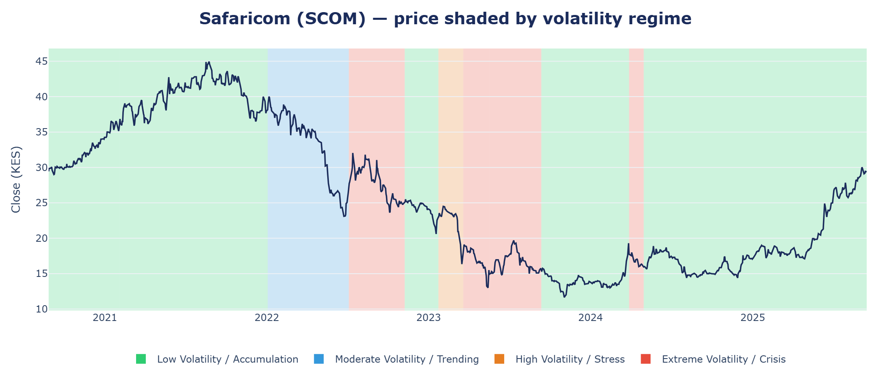

# Markets Speak in Regimes — An analysis of Safaricom's stock behaviour

A data-driven study of Safaricom PLC (NSE: **SCOM**) equity behaviour that reframes the question
from *"where will the price go?"* to *"what regime are we in, and how is risk being priced?"*

> **Thesis — predict risk, not price.** Safaricom's daily returns are largely unpredictable in the
> mean, but its **volatility is structured**: it clusters, persists, and moves through distinct
> regimes punctuated by structural breaks. Volatility, not price direction, is the informative and
> modellable signal. The 2025–2026 Vodacom takeover provides a live, out-of-sample confirmation of
> this framework.



<p align="center"><em>Five years of Safaricom's price, painted with its own volatility regimes —
calm accumulation (green) through to crisis (red) — segmented by Ruptures PELT change-point detection
over a four-component GMM. Regime, not price direction, is the signal.</em></p>

---

## What's in this repository

| Path | Description |
|------|-------------|
| [`report/`](report/) | **Markets-Speak-in-Regimes-Report.docx** — the full analytical report (final, publish-ready). |
| [`presentation/`](presentation/) | **Markets-Speak-in-Regimes-Slides.pptx** — the accompanying summary deck. |
| [`notebooks/`](notebooks/) | The analysis notebooks — see *Notebooks* below. |
| [`dashboard/`](dashboard/) | Interactive **Streamlit** risk dashboard (price, volatility, regimes, VaR). See *Running the dashboard* below. |
| [`data/`](data/) | **SAFCOM_5YR_PRICE.xlsx** — the source dataset (1,260 NSE trading days, 26 Aug 2020 – 15 Sep 2025). |

---

## Notebooks

Two Jupyter notebooks in [`notebooks/`](notebooks/) document the analysis:

- **`Jeff_modeling.ipynb`** — the initial exploratory analysis and modelling on the 5-year dataset
  (diagnostics, decomposition, structural breaks, and early volatility/regime work) that the report
  is built on.
- **`Jeff_modeling_Phase1_Corrections.ipynb`** — a companion change-log notebook that documents and
  *verifies* a set of corrections to the initial analysis (STL period, QQ-plot skew reading, GMM
  regime-count selection via the BIC elbow, and a two-test **Kupiec + Christoffersen** VaR backtest).
  Each item is presented as *problem → before/after → why* and re-run live on the data.

To run them: `pip install -r dashboard/requirements.txt jupyter`, then `jupyter lab notebooks/`.

---

## Running the dashboard locally

The dashboard ships with a pre-built dataset (`dashboard/data/safcom_base.csv`), so it runs
immediately — no data step required.

**1. Create and activate an environment** (Python 3.11+):
```bash
# conda
conda create -n safcom python=3.12 -y
conda activate safcom
# — or — venv
python -m venv .venv
.venv\Scripts\activate        # Windows   (source .venv/bin/activate on macOS/Linux)
```

**2. Install dependencies:**
```bash
pip install -r dashboard/requirements.txt
```

**3. Launch:**
```bash
cd dashboard
streamlit run app.py
```
The app opens at `http://localhost:8501` with four tabs:

- **Overview** — price and daily returns, with Vodacom event markers.
- **Volatility** — 21/63/252-day rolling volatility and a live GARCH(1,1)-t fit.
- **Regimes** — price shaded into volatility episodes (Ruptures PELT), coloured by GMM regime; a
  sidebar slider controls episode granularity.
- **Risk / VaR** — GARCH-t conditional Value-at-Risk with a live Kupiec + Christoffersen backtest.

### Optional: extend the data past September 2025 (the Vodacom era)

The bundled data ends 15 Sep 2025 — before the Vodacom deal. To pull the post-takeover days and see
the out-of-sample regime band appear automatically:
```bash
setx EODHD_API_KEY "your-eodhd-key"    # Windows; reopen the shell afterwards
python dashboard/data/fetch_eodhd.py   # pulls Sep 2025 → Jun 2026 (needs internet)
python dashboard/data/merge_data.py    # rebuilds safcom_base.csv from data/SAFCOM_5YR_PRICE.xlsx + the extension
```

---

## Methodology (summary)

- **Diagnostics:** stationarity (ADF/KPSS), non-normality (QQ, Jarque-Bera), ARCH-LM for
  heteroskedasticity, ACF/PACF of absolute & squared returns for volatility memory.
- **Structural breaks & regimes:** Ruptures PELT change-point detection; a Gaussian Mixture Model
  identifies **four** volatility regimes (parsimonious/BIC-elbow choice).
- **Volatility:** GARCH(1,1) with Student-t errors (high persistence, fat tails); GJR-GARCH and EVT
  are the next-phase extensions.
- **Risk:** conditional VaR validated on **two** tests — Kupiec (coverage) *and* Christoffersen
  (independence). The conditional GARCH-t VaR passes both; a naive constant VaR passes coverage but
  its exceptions cluster.

## Data note

`data/SAFCOM_5YR_PRICE.xlsx` is a clean NSE trading calendar (weekends and exchange holidays already
excluded by the provider). No further business-day filtering is applied downstream.

---

*Author: David Mutugi Kirianja — Data Scientist. For analytical/educational use; not investment advice.*
